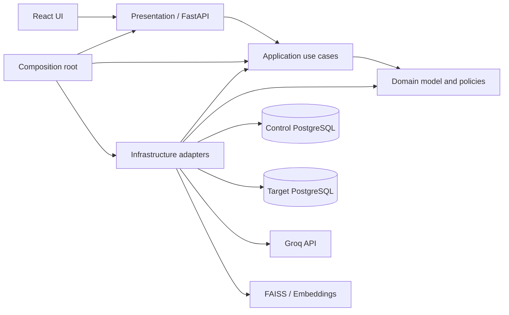
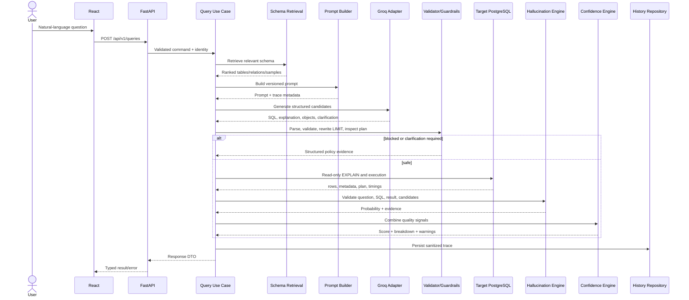

# Architecture Blueprint

## 1. Architectural goals and decisions

The platform begins as a **modular monolith** with enforceable clean-architecture boundaries. This minimizes operational complexity while keeping schema retrieval, model access, validation, execution, and scoring independently replaceable. Provider and database details live behind ports; application use cases depend only on domain contracts.

The platform uses two database concerns:

1. **Control plane database** — stores users, target connection descriptors, query history, feedback, prompt versions, and audit events.
2. **Target data plane databases** — customer PostgreSQL databases inspected and queried using separately scoped, read-only credentials.

Secrets are never stored in history or logs. A connection record stores a secret reference suitable for a production secret manager. Schema snapshots and bounded samples are cached in the control plane; sensitive-column sampling can be disabled by policy.

## 2. Folder structure

```text
text2sql-ai/
├── backend/
│   ├── app/
│   │   ├── domain/
│   │   │   ├── entities/
│   │   │   ├── value_objects/
│   │   │   ├── policies/
│   │   │   ├── ports/
│   │   │   └── exceptions.py
│   │   ├── application/
│   │   │   ├── commands/
│   │   │   ├── queries/
│   │   │   ├── dto/
│   │   │   ├── services/
│   │   │   └── interfaces/
│   │   ├── infrastructure/
│   │   │   ├── persistence/
│   │   │   │   ├── sqlalchemy/
│   │   │   │   ├── repositories/
│   │   │   │   └── migrations/
│   │   │   ├── target_database/
│   │   │   ├── schema/
│   │   │   ├── retrieval/
│   │   │   ├── llm/groq/
│   │   │   ├── sql/
│   │   │   ├── observability/
│   │   │   └── security/
│   │   ├── presentation/
│   │   │   └── api/
│   │   │       ├── v1/routes/
│   │   │       ├── dependencies/
│   │   │       ├── middleware/
│   │   │       └── schemas/
│   │   ├── bootstrap/
│   │   │   ├── container.py
│   │   │   └── lifespan.py
│   │   ├── config/
│   │   └── main.py
│   ├── tests/
│   │   ├── unit/
│   │   ├── integration/
│   │   ├── contract/
│   │   └── fixtures/
│   ├── pyproject.toml
│   └── alembic.ini
├── frontend/
│   ├── src/
│   │   ├── app/
│   │   ├── features/{query,schema,history,feedback}/
│   │   ├── components/
│   │   ├── api/
│   │   ├── hooks/
│   │   ├── types/
│   │   ├── styles/
│   │   └── test/
│   ├── package.json
│   └── vite.config.ts
├── config/
│   ├── guardrails.example.yaml
│   ├── confidence.example.yaml
│   └── prompts/
├── docker/
│   ├── backend.Dockerfile
│   └── frontend.Dockerfile
├── docs/
│   ├── architecture/
│   ├── api/
│   ├── runbooks/
│   └── phases/
├── scripts/
├── .env.example
├── docker-compose.yml
└── README.md
```

The original feature-oriented names remain represented, but clean-architecture layers prevent API handlers from directly importing SQLAlchemy, Groq, or FAISS implementations.

## 3. Dependency graph



Allowed dependency direction is inward: presentation depends on application contracts; infrastructure implements domain/application ports; only the composition root knows concrete implementations. Domain code imports neither FastAPI, SQLAlchemy, Groq, Pandas, nor FAISS.

## 4. Module responsibilities

| Module | Responsibility | Explicitly excludes |
|---|---|---|
| Domain | Query lifecycle entities, schema value objects, validation/scoring policies, repository ports | Framework/provider code |
| Application | Orchestrate use cases, transaction boundaries, DTO mapping | HTTP and vendor SDK details |
| Presentation | HTTP validation, auth context, status/error mapping, streaming transport | SQL or scoring business rules |
| Control persistence | Metadata models, repositories, migrations, unit of work | Target query execution |
| Target database | Connection factory, read-only sessions, inspection and execution adapters | Secret ownership and API concerns |
| Schema | Extract, normalize, snapshot, classify sensitive fields | Semantic retrieval |
| Retrieval | Embed schema units and return ranked relevant context | Prompt wording |
| Prompt | Assemble versioned prompt inputs and output contract | LLM network calls |
| Groq adapter | Model selection, retries, streaming, rate-limit mapping, typed response decoding | Validation/guardrail policy |
| SQL validation | Parse AST, syntax and referenced-object checks | Query execution |
| Guardrails | Statement/policy checks, LIMIT rewrite, plan-cost decision, audit event creation | Transport formatting |
| Execution | Read-only execution, rollback, DataFrame/result metadata, EXPLAIN | SQL generation |
| Hallucination | Independent validators and calibrated probability/explanation | Final confidence weighting |
| Confidence | Weighted score, breakdown, warnings | Re-running pipeline stages |
| History/feedback | Persist traceable outcomes and human signals | Model training inside request path |

## 5. Design patterns

- **Ports and adapters:** isolates Groq, PostgreSQL, FAISS, embeddings, and secret stores.
- **Repository + Unit of Work:** persistence through aggregate-oriented interfaces and explicit transaction scope.
- **Service layer / Use case:** one application handler per user action; keeps routers thin.
- **Strategy:** interchangeable LLM models, retrieval algorithms, validators, and scoring policies.
- **Chain of Responsibility:** ordered guardrails and hallucination validators return typed evidence.
- **Specification:** composable SQL safety rules and schema-coverage checks.
- **Factory:** builds target engines and provider clients from validated configuration.
- **Adapter:** converts provider/database payloads into stable internal DTOs.
- **Dependency injection:** constructor injection in application code; FastAPI dependencies only at the edge.
- **Outbox-ready audit design:** blocked-query and feedback events can later be published reliably without coupling the initial deployment to a broker.

## 6. Database architecture

### Control plane logical model

| Aggregate/table | Key fields and purpose |
|---|---|
| `data_sources` | id, tenant_id, name, secret_ref, options, status |
| `schema_snapshots` | id, data_source_id, version, checksum, structured_schema, captured_at |
| `prompt_versions` | id, name, version, template, status, created_at |
| `query_runs` | id, tenant_id, user_id, question, generated_sql_redacted, status, timings, model, prompt_version |
| `query_evaluations` | query_run_id, hallucination evidence, confidence breakdown, warnings |
| `feedback` | id, query_run_id, rating, correction, comment |
| `guardrail_events` | id, query_run_id, rule_code, sanitized_sql, details, occurred_at |

All tenant-owned tables include `tenant_id` directly or inherit it through an immutable parent, with indexes supporting tenant + recency access. JSONB holds versioned evidence/snapshots while searchable lifecycle fields remain relational. Alembic owns control-plane migrations.

### Target access

- One bounded SQLAlchemy engine pool per active data source, cached with eviction.
- Separate least-privilege PostgreSQL role with `SELECT` only; transaction is also set `READ ONLY`.
- `statement_timeout`, lock timeout, maximum rows, and pool limits are mandatory.
- PostgreSQL inspection/catalog queries extract tables, columns, PKs, FKs, relationships, indexes, and bounded sample values.
- Schema JSON is versioned and checksum-addressed. Identifiers retain schema qualification.
- Sample values are capped, normalized, and excluded for policy-classified sensitive columns.

Schema JSON top-level contract:

```json
{
  "data_source_id": "uuid",
  "captured_at": "RFC3339 timestamp",
  "dialect": "postgresql",
  "schemas": [{
    "name": "public",
    "tables": [{
      "name": "orders",
      "columns": [],
      "primary_key": [],
      "foreign_keys": [],
      "relationships": [],
      "indexes": [],
      "sample_values": {}
    }]
  }]
}
```

## 7. API architecture

Base path: `/api/v1`. Every response carries `X-Request-ID`; errors use a stable envelope `{error: {code, message, details, request_id}}`.

| Method and route | Purpose |
|---|---|
| `POST /queries` | Run the complete natural-language-to-result workflow |
| `POST /queries/stream` | Stream stage/model events via SSE; execution completion remains typed |
| `POST /queries/{id}/execute` | Validate and execute user-edited SQL through the same guardrails |
| `GET /queries/{id}` | Retrieve one run and its evidence |
| `GET /queries` | Paginated, tenant-scoped history |
| `POST /data-sources` | Register a target using a secret reference |
| `POST /data-sources/{id}/schema/refresh` | Extract and version schema |
| `GET /data-sources/{id}/schema` | Return structured schema snapshot |
| `POST /queries/{id}/feedback` | Record rating/correction |
| `GET /health/live` | Process liveness |
| `GET /health/ready` | Dependency readiness |

Authentication is an injected identity provider port; authorization is tenant/resource based. Idempotency keys protect mutating requests. Pagination is cursor-based. OpenAPI/Pydantic contracts generate the frontend client.

## 8. Data flow



The guardrail plan check occurs before data-returning execution. Multi-query verification means multiple independently generated **candidates**, never multiple SQL statements in one executable request.

## 9. Class diagram

```mermaid
classDiagram
  class RunTextToSql { +execute(command) QueryOutcome }
  class SchemaRepository { <<interface>> +latest(dataSourceId) SchemaSnapshot }
  class QueryRunRepository { <<interface>> +add(run) +get(id) }
  class SchemaRetriever { <<interface>> +retrieve(question, snapshot) RelevantSchema }
  class PromptBuilder { <<interface>> +build(context, version) Prompt }
  class LLMGateway { <<interface>> +generate(prompt, options) LLMResult +stream(prompt, options) }
  class SqlValidator { <<interface>> +validate(sql, schema) ValidationResult }
  class GuardrailEngine { +evaluate(ast, context) GuardrailDecision }
  class GuardrailRule { <<interface>> +check(ast, context) RuleResult }
  class QueryExecutor { <<interface>> +explain(sql) ExplainPlan +execute(sql) ExecutionResult }
  class HallucinationEngine { +evaluate(input) HallucinationAssessment }
  class HallucinationCheck { <<interface>> +evaluate(input) Evidence }
  class ConfidenceEngine { +calculate(signals) ConfidenceAssessment }
  class UnitOfWork { <<interface>> +commit() +rollback() }

  RunTextToSql --> SchemaRepository
  RunTextToSql --> QueryRunRepository
  RunTextToSql --> SchemaRetriever
  RunTextToSql --> PromptBuilder
  RunTextToSql --> LLMGateway
  RunTextToSql --> SqlValidator
  RunTextToSql --> GuardrailEngine
  RunTextToSql --> QueryExecutor
  RunTextToSql --> HallucinationEngine
  RunTextToSql --> ConfidenceEngine
  RunTextToSql --> UnitOfWork
  GuardrailEngine o-- GuardrailRule
  HallucinationEngine o-- HallucinationCheck
```



## 10. Cross-cutting architecture

- **Configuration:** Pydantic settings load environment variables; YAML is allowed for versioned guardrail/confidence policy, with environment overrides.
- **Logging:** structured JSON with request/query-run IDs; SQL and sample data are redacted by default. Every blocked query creates a security audit event.
- **Errors:** domain/application exceptions map once at the API boundary to stable codes; raw provider/database messages are not exposed.
- **Observability:** OpenTelemetry-ready traces and metrics cover stage latency, tokens, retries, blocks, execution cost, confidence, and feedback.
- **Testing:** domain rules use unit tests; adapters use contract tests; PostgreSQL behavior uses disposable integration databases; API/UI use boundary tests; an offline evaluation set tracks text-to-SQL quality.
- **Security:** tenant isolation, least privilege, secret references, allowlisted data sources, read-only transactions, timeouts, AST parsing, plan-cost thresholds, and output/sample caps.
- **Scalability:** stateless API replicas; externalized metadata; bounded pools/caches; schema refresh and embedding can move to workers when scale justifies a queue.

## 11. Architectural acceptance rules

1. No endpoint imports a concrete repository, Groq SDK, SQLAlchemy session, or FAISS index.
2. No generated SQL reaches execution without AST validation, guardrails, and plan approval.
3. Target credentials are independently read-only and are not persisted as plaintext.
4. Every request is tenant-scoped, traceable, bounded by time/rows/cost, and safe to redact.
5. Scoring outputs always include component evidence and configuration version.
6. Each delivery phase begins with a reuse audit and ends with passing relevant tests plus its completion report.
